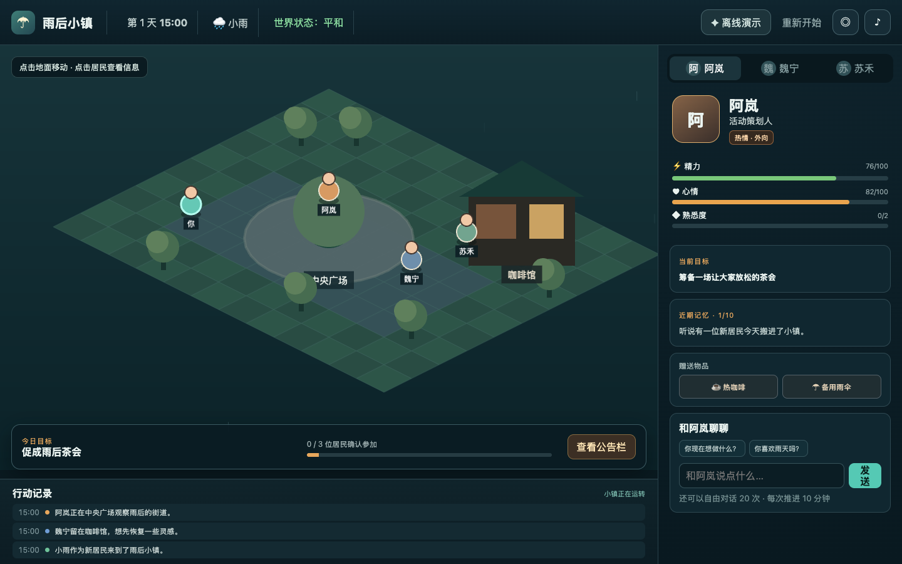

# 雨后小镇（After Rain Town）

一款面向桌面浏览器的等距视角 AI 小镇 Web 游戏。玩家扮演刚搬来的居民，在第一天 15:40—18:00 之间观察三名 NPC 的生活、自由交谈、赠送物品，并介入逐步关联的雨后茶会事件。

- 在线体验：[https://after-rain-town.vercel.app](https://after-rain-town.vercel.app)
- 后端健康检查：[https://after-rain-town-api.onrender.com/actuator/health](https://after-rain-town-api.onrender.com/actuator/health)
- 推荐环境：桌面端 Chrome / Edge，宽度 1280px 以上



## 已实现内容

### 地图与基础交互

- 一张雨后小镇等距地图，包含中央广场、咖啡馆、花园和新居四个逻辑地点。
- 玩家点击地面移动；使用 12×10 可行走网格和 A* 寻路绕开建筑障碍。
- 玩家移动时根据方向切换正面/背面素材并左右翻转，结束后恢复正面。
- NPC 可点击选中，右侧面板展示身份、性格、当前目标、行动、心情、精力、关系和近期记忆。
- 持续雨景、环境音、地点标签、行动记录和事件地点光圈。

> 当前 A* 只用于玩家移动。NPC 根据 Agent 日程或事件规则移动到地点锚点，移动过程使用补间动画，并未对每名 NPC 执行完整地图寻路。

### 三名差异化 NPC

| NPC | 身份与性格 | 初始目标 | 行为差异 |
| --- | --- | --- | --- |
| 阿岚 | 活动策划人；热情、外向 | 筹备让居民放松的茶会 | 经常前往广场和花园，主动推进聚会 |
| 魏宁 | 自由插画师；安静、谨慎 | 完成雨后街景插画 | 倾向留在咖啡馆或独自散步，参加活动的关系门槛更高 |
| 苏禾 | 咖啡馆店主；沉稳、务实 | 照看咖啡馆并留意居民 | 在咖啡馆与广场之间准备热水、茶点和杯具 |

每名 NPC 都有独立的日程、目标、地点、行动、心情、精力、玩家关系、近期记忆和长期印象。人物不是依靠单段固定动画循环：日程决定默认行动，主要事件会临时覆盖日程，玩家选择又会更新后续关系、心情、记忆和事件结果。

### Agent 与事件系统

- 游戏时间每 8 秒推进 5 分钟，NPC 按各自的简单日程改变地点和行动。
- 非主要事件期间，NPC 有 30% 概率产生无 API 成本的背景气泡，并有至少 15 秒冷却。
- 一局同时只保留一个可供玩家介入的主要事件；主要事件持续期间暂停普通背景气泡，避免信息相互争抢。
- 三个主要事件骨架固定：`雨后茶会筹备`、`创意分歧`、`黄昏小镇聚会`。
- 未发布茶会公告时，每个事件只在自己的 10 分钟检查窗口进行一次 30% 概率判定；提前发布公告后，尚未经过检查窗口的事件会必定进入主流程，便于面试演示。
- 事件通过顶部简短通知、地点光圈和 NPC 头顶特殊气泡同时提示。
- 玩家点击地图事件光圈或事件卡片后，可选择“加入交谈、主动帮忙、进行调解或暂不介入”，再选择温和、直接或幽默态度，并可编辑一句关键回应。
- 参与事件会轻量影响关系、心情、NPC 间关系、茶会准备度、日程、记忆和 18:00 结局。
- 每名 NPC 最多保留 10 条近期记忆和 3 条长期印象；长期印象目前在黄昏主要事件结算时形成。
- 全局最多进行 20 次自由对话。主要事件台词不占用这 20 次额度。

这套 Agent 是“本地规则 + 生成式台词”的混合方案：移动、日程、概率、数值和结算由确定性规则控制；AI 只负责自由对话及主要事件中的角色化关键台词。这样可以避免模型直接修改世界状态，也保证没有密钥或模型超时时仍能完整通关。

## AI 接入与降级

后端通过 OpenAI 兼容的 `POST /chat/completions` 接口访问模型，供应商、模型名和密钥均由环境变量配置。API Key 只存在于 Java 后端，不会进入浏览器包或 Git 仓库。

### 自由对话

1. 后端把 NPC 身份、性格、目标、关系、茶会状态和近期记忆组装为角色上下文。
2. 请求关闭思考模式并开启流式输出。
3. Spring Boot 将模型片段转为 NDJSON；React 边读取边更新对话框。
4. 主模型失败时尝试备用模型；两者均失败或未配置密钥时返回角色专属内置回复。

### 主要事件台词

每名参与 NPC 独立发起一次流式请求，多名 NPC 并行生成并分别更新自己的台词区域。模型约 5 秒未响应时，该 NPC 无感切换为内置事件台词；页面不弹出技术错误，事件仍按本地规则正常结算。若模型已返回部分文字后中断，则保留已收到的内容。

当前响应来源会显示为：

- `LIVE`：真实模型完成响应；
- `LIVE_FALLBACK` / `LIVE_PARTIAL`：备用模型完成或保留部分流式结果；
- `MOCK`：未配置密钥、模型超时或调用失败，使用内置角色回复；
- `OFFLINE`：浏览器无法连接后端，前端继续使用本地降级流程。

顶部“真实 AI / 稳定演示”按钮可随时切换。稳定演示不调用模型，没有延迟和 API 成本。

## 技术栈

| 层级 | 技术 | 用途 |
| --- | --- | --- |
| 游戏前端 | React 19、TypeScript 5.9、Vite 7 | 界面、状态管理、事件介入流程和构建 |
| 地图渲染 | Phaser 3.90 | 等距坐标、人物、补间移动、雨景和交互热区 |
| 后端 | Java 17、Spring Boot 3.5 | 匿名会话、存档、输入校验、AI 代理和流式转发 |
| 数据访问 | Spring Data JPA | 会话与 JSON 快照持久化 |
| 数据库 | PostgreSQL 17；本地开发使用 H2 | 线上持久化与免安装本地运行 |
| AI 协议 | OpenAI-compatible Chat Completions | 可替换模型供应商的角色对话接口 |
| 部署 | Vercel、Render、Docker | 前端、后端与 PostgreSQL 托管 |
| 验证 | JUnit 5、Spring Boot Test、Oxlint | 后端集成测试、前端静态检查 |

## 架构与数据流

```text
浏览器
├─ React：面板、事件流程、关系与结局
├─ Phaser：地图、寻路、人物和雨景
├─ localStorage：即时本地存档
└─ SaveData：完整 Agent 状态
        │
        │ REST / NDJSON
        ▼
Spring Boot API
├─ UUID 匿名游戏会话
├─ 输入校验与 20 次自由对话限制
├─ AI 上下文组装、流式代理和降级
└─ GameState + 完整前端快照
        │                 │
        ▼                 ▼
   PostgreSQL      OpenAI 兼容模型 API
```

当前采用双层状态：

- `game-ui/src/agentSystem.ts` 中的 `SaveData` 是前端玩法状态，包含日程、事件、关系、记忆、礼物和结局数据；每次变化先写入 `localStorage`，有后端会话时再防抖同步完整 JSON 快照。
- `game-api` 中的 `GameState` 保存服务端会话、自由对话计数、NPC 对话上下文和行动日志。

这是 12 小时原型期内的取舍：页面即使断网也能继续完成主流程，同时后端仍能保护密钥、限制对话次数并持久化会话快照。当前页面启动时从 `localStorage` 恢复，尚未自动从服务端拉取快照；生产化版本应进一步合并状态模型并增加版本化事件日志。

## 主要接口

| 方法 | 路径 | 作用 |
| --- | --- | --- |
| `POST` | `/api/games` | 创建匿名游戏会话 |
| `GET` | `/api/games/{id}` | 读取服务端世界状态 |
| `PUT` | `/api/games/{id}` | 保存服务端世界状态 |
| `POST` | `/api/games/{id}/reset` | 重置服务端会话 |
| `POST` | `/api/games/{id}/dialogue/stream` | 自由对话 NDJSON 流 |
| `POST` | `/api/games/{id}/events/dialogue/stream` | 多 NPC 主要事件台词 NDJSON 流 |
| `PUT` | `/api/games/{id}/snapshot` | 保存完整前端快照 |
| `GET` | `/api/games/{id}/snapshot` | 读取完整前端快照 |
| `GET` | `/actuator/health` | 部署健康检查 |

流式接口按行返回 JSON。`delta` 表示新增文本片段，`done` 携带最终结果；事件流额外包含 `npcId`，因此多名 NPC 的片段可以交错返回。

## 本地运行

要求：Node.js 20+、Java 17+、Maven 3.9+。本地开发配置使用 H2 内存数据库，不需要安装 PostgreSQL。

### 1. 启动后端

```bash
cd game-api
mvn spring-boot:run -Dspring-boot.run.profiles=dev
```

后端默认运行在 `http://localhost:8080`。

### 2. 启动前端

另开一个终端：

```bash
cd game-ui
npm install
npm run dev -- --port 5174
```

打开 [http://localhost:5174](http://localhost:5174)。不配置 AI Key 时，点击“稳定演示”或直接游玩即可完整跑通。

### 3. 可选：配置真实 AI

可参考仓库根目录的 `.env.example`。运行后端前在终端设置环境变量：

```bash
export AI_API_KEY="你的后端模型密钥"
export AI_BASE_URL="https://你的模型服务/v1"
export AI_MODEL="该服务支持的模型名"
export AI_FALLBACK_MODEL="备用模型名"
export AI_READ_TIMEOUT_SECONDS="5"
mvn spring-boot:run -Dspring-boot.run.profiles=dev
```

模型服务需兼容 Chat Completions 的消息格式和 SSE 流式响应。不要使用 `VITE_` 前缀保存密钥；所有 `VITE_` 变量都会进入前端构建产物。

## 自动化验证

前端：

```bash
cd game-ui
npm run lint
npm run build
```

后端：

```bash
cd game-api
mvn test
```

目前共有 6 项后端集成测试，覆盖：初始世界创建与恢复、无密钥时 AI 降级、20 次对话计数、每名 NPC 10 条记忆上限、客户端快照、自由对话流式持久化，以及多 NPC 事件流不消耗自由对话额度。

## 部署

### Vercel 前端

1. 导入本仓库，Root Directory 设为 `game-ui`。
2. 添加 `VITE_API_URL=https://after-rain-town-api.onrender.com`。
3. 使用 `npm run build` 构建，输出目录为 `dist`。

### Render 后端与数据库

仓库根目录的 `render.yaml` 会创建：

- 新加坡区域的 Docker Web Service；
- PostgreSQL 17 数据库；
- `/actuator/health` 健康检查；
- 数据库连接、前端 CORS、AI 服务和 5 秒读取超时环境变量。

部署时必须在 Render 控制台填写 Secret：

- `FRONTEND_ORIGIN=https://after-rain-town.vercel.app`
- `AI_API_KEY=真实密钥`（不填写则自动使用内置回复）

如更换供应商，还要同步修改 `AI_BASE_URL`、`AI_MODEL` 和 `AI_FALLBACK_MODEL`，模型名必须以供应商实际支持列表为准。

Render 免费实例会休眠，首次访问可能有冷启动；免费 PostgreSQL 也有平台规定的有效期。面试前应提前打开线上地址完成预热，并确认健康检查为 `UP`。

## 关键设计决策

1. **规则负责世界，AI 负责表达。** 让模型直接决定数值、位置和结局会带来不可复现结果；因此 AI 只能输出台词，所有状态修改由本地白名单规则结算。
2. **固定事件骨架 + 动态关键台词。** 三个事件保证主流程可演示，角色化台词又能体现生成能力；背景互动全部本地生成以降低延迟和费用。
3. **单一主要事件。** 同时只允许一个可介入事件，避免面试体验中通知堆叠和状态冲突。
4. **概率事件提供变化，公告提供确定性。** 默认 30% 触发让重复游玩存在差异；发布公告后保证主流程出现，便于验收。
5. **双重存档。** `localStorage` 保证即时、离线和刷新后恢复，PostgreSQL 保存同一份快照并为后续跨设备恢复提供基础；当前客户端启动恢复仍以本地存档为准。
6. **逐 NPC 并行流式生成。** 主要事件不用等待所有角色完成后再展示；任意一个 NPC 超时只降级该角色，不阻塞其他角色。
7. **静态等距场景 + 逻辑网格。** 在有限工期内优先保证视觉完成度和可操作性；地图没有采用重型编辑器或完整物理系统。

## 一处 AI 功能迭代示例

早期版本的事件接口会先等待模型一次性返回所有 NPC 的 JSON，再把每句完整台词发送给前端。实际体验中，玩家点击后会看到较长空白等待，而且任意一个角色失败都会让整组回复降级。

当前版本改为：

- 为每名参与 NPC 单独构造角色上下文；
- 关闭模型思考模式并设置 `stream: true`；
- 使用并行任务请求最多三名 NPC；
- 后端收到一个 SSE token 就立即写出一条 NDJSON `delta`；
- 前端按 `npcId` 分别拼接文字；
- 约 5 秒超时后只降级对应 NPC，最后仍由本地规则统一结算。

相关实现位于：

- `game-api/src/main/java/cn/edu/ustc/afterrain/ai/AiDialogueService.java`
- `game-api/src/main/java/cn/edu/ustc/afterrain/game/GameService.java`
- `game-api/src/main/java/cn/edu/ustc/afterrain/game/GameController.java`
- `game-ui/src/api.ts`

## 面试演示路线（3—5 分钟）

1. 输入名字进入小镇，点击不同地面展示玩家转向和 A* 绕障碍移动。
2. 依次选择阿岚、魏宁和苏禾，展示不同身份、目标、地点、行动与记忆。
3. 点击“发布活动”，保证三段主要事件进入流程；观察通知、光圈和特殊气泡。
4. 介入事件，选择“调解 → 温和”，编辑一句话并观察各 NPC 流式回应和数值结算。
5. 自由对话一次，再切到“稳定演示”，说明没有密钥或调用超时时仍可完整体验。
6. 点击“影响世界”，查看玩家关系、NPC 间关系、完成事件和茶会准备度。
7. 如时间允许推进到 18:00，展示结局和长期印象。

## 当前限制

- 单人、匿名会话，不包含登录、多人同步和权限系统。
- 主要面向桌面浏览器，尚未专门适配手机触控和小屏布局。
- 没有房屋室内场景切换，也没有背包扩展、任务编辑器或地图编辑器。
- NPC 行动由简单日程和事件规则驱动，不是让大模型自由规划长期行动。
- NPC 移动使用地点锚点补间，只有玩家使用完整 A* 网格寻路。
- 完整 Agent 状态以浏览器快照为主，尚未实现服务端事件溯源及多设备冲突合并。
- 线上免费服务可能冷启动；真实 AI 的首字超过 5 秒时会优先保证可玩性并使用内置回复。

## 安全说明

- `.env.example` 只提供变量名，不包含真实密钥。
- AI Key 仅由 Spring Boot 从服务端环境变量读取。
- 玩家姓名、自由对话、事件标题和事件台词均设置长度限制；前端快照限制为 100 KB。
- 服务端每局最多接受 20 次自由对话，行动日志最多保存 50 条。
- 本项目是面试原型，不应直接承载敏感个人信息或高并发生产流量。
